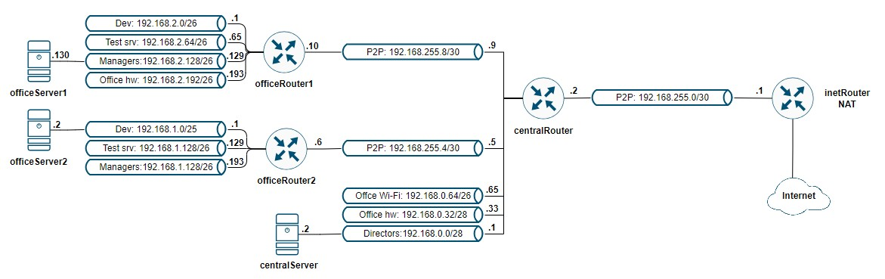

# LAB-19
## Стенд c сетевой лабораторией
### Цели
- Научится менять базовые сетевые настройки в Linux-based системах.

## Описание домашнего задания
1. Скачать и развернуть Vagrant-стенд https://github.com/erlong15/otus-linux/tree/network
2. Построить следующую сетевую архитектуру:

Сеть office1
- 192.168.2.0/26      - dev
- 192.168.2.64/26     - test servers
- 192.168.2.128/26    - managers
- 192.168.2.192/26    - office hardware

Сеть office2
- 192.168.1.0/25      - dev
- 192.168.1.128/26    - test servers
- 192.168.1.192/26    - office hardware

Сеть central
- 192.168.0.0/28     - directors
- 192.168.0.32/28    - office hardware
- 192.168.0.64/26    - wifi

Итого должны получиться следующие сервера:
- inetRouter
- centralRouter
- office1Router
- office2Router
- centralServer
- office1Server
- office2Server

Теоретическая часть: 
- Найти свободные подсети
- Посчитать количество узлов в каждой подсети, включая свободные
- Указать Broadcast-адрес для каждой подсети
- Проверить, нет ли ошибок при разбиении

Практическая часть: 
- Соединить офисы в сеть согласно логической схеме и настроить роутинг
- Интернет-трафик со всех серверов должен ходить через inetRouter
- Все сервера должны видеть друг друга (должен проходить ping)
- У всех новых серверов отключить дефолт на NAT (eth0), который vagrant поднимает для связи
- Добавить дополнительные сетевые интерфейсы, если потребуется

## Комментарии
1. С помощью Vagrant и Ansible разварачиваются и настраиваются семь ВМ
2. В процессе запуска выполняется проверка настроек сети путем запуска команда ping и traceroute со всех зостов в группе servers