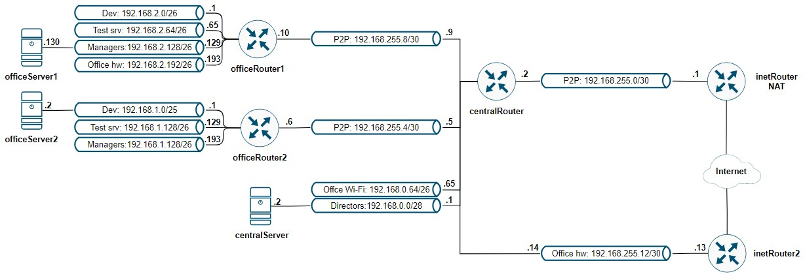

# LAB-21
## Сценарии iptables
### Цели
- Написать сценарии iptables.

## Описание домашнего задания
1. Реализовать knocking port:
centralRouter может попасть на ssh inetrRouter через knock скриптпример в материалах.
2. Добавить inetRouter2, который виден(маршрутизируется (host-only тип сети для виртуалки)) с хоста или форвардится порт через локалхост.
3. Запустить nginx на centralServer.
4. Пробросить 80й порт на inetRouter2 8080.
5. Дефолт в инет оставить через inetRouter.



## Комментарии
1. С помощью Vagrant и Ansible разварачиваются и настраиваются семь ВМ
2. Проверка реализации knocking port:    
```bash
root@centralServer:~# ping 192.168.255.1
PING 192.168.255.1 (192.168.255.1) 56(84) bytes of data.
64 bytes from 192.168.255.1: icmp_seq=1 ttl=63 time=1.68 ms
64 bytes from 192.168.255.1: icmp_seq=2 ttl=63 time=2.08 ms
64 bytes from 192.168.255.1: icmp_seq=3 ttl=63 time=2.09 ms
^C
--- 192.168.255.1 ping statistics ---
3 packets transmitted, 3 received, 0% packet loss, time 2002ms
rtt min/avg/max/mdev = 1.683/1.950/2.093/0.189 ms
root@centralServer:~# ssh 192.168.255.1
ssh: connect to host 192.168.255.1 port 22: Connection timed out
root@centralServer:~# for p in 10001 20002 30003 40004 ; do curl -s -m0.2 "192.168.255.1:$p" ; done || ssh 192.168.255.1
The authenticity of host '192.168.255.1 (192.168.255.1)' can't be established.
ED25519 key fingerprint is SHA256:gP3DUfGSIqcyaC40iE2uEhKxUATX+2SrmYVV8kcRrtc.
This key is not known by any other names.
Are you sure you want to continue connecting (yes/no/[fingerprint])? 
```
3. Проверка проброса 80 порта на centralServer:    
```bash
root@otus:~/otus-linux/Lab-21# curl 192.168.11.18:8080
<!DOCTYPE html>
<html>
<head>
<title>Welcome to nginx!</title>
<style>
html { color-scheme: light dark; }
body { width: 35em; margin: 0 auto;
font-family: Tahoma, Verdana, Arial, sans-serif; }
</style>
</head>
<body>
<h1>Welcome to nginx!</h1>
<p>If you see this page, the nginx web server is successfully installed and
working. Further configuration is required.</p>

<p>For online documentation and support please refer to
<a href="http://nginx.org/">nginx.org</a>.<br/>
Commercial support is available at
<a href="http://nginx.com/">nginx.com</a>.</p>

<p><em>Thank you for using nginx.</em></p>
</body>
</html>
```
