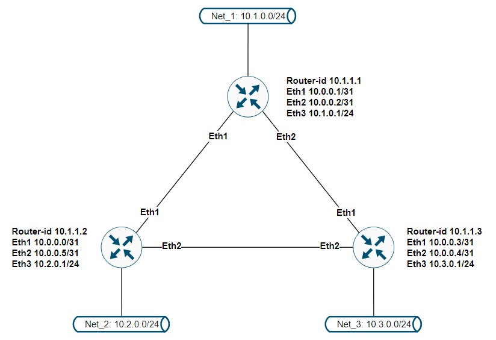

# LAB-22
## Vagrant-стенд c OSPF
### Цели
- Создать домашнюю сетевую лабораторию. Научится настраивать протокол OSPF в Linux-based системах.

## Описание домашнего задания
1. Развернуть 3 виртуальные машины
2. Объединить их разными vlan
- настроить OSPF между машинами на базе Quagga;
- изобразить ассиметричный роутинг;
- сделать один из линков "дорогим", но что бы при этом роутинг был симметричным.




## Комментарии
1. С помощью Vagrant и Ansible разварачиваются и настраиваются семь ВМ
2. Проверка работы ospf на примере router01:    
```bash
router01# sh ip ospf neighbor 

Neighbor ID     Pri State           Up Time         Dead Time Address         Interface                        RXmtL RqstL DBsmL
10.1.1.2          1 Full/-          10m42s            37.756s 10.0.0.0        eth1:10.0.0.1                        0     0     0
10.1.1.3          1 Full/-          10m37s            37.784s 10.0.0.3        eth2:10.0.0.2                        0     0     0

router01# 
router01# 
router01# sh ip route
Codes: K - kernel route, C - connected, S - static, R - RIP,
       O - OSPF, I - IS-IS, B - BGP, E - EIGRP, N - NHRP,
       T - Table, v - VNC, V - VNC-Direct, A - Babel, F - PBR,
       f - OpenFabric,
       > - selected route, * - FIB route, q - queued, r - rejected, b - backup
       t - trapped, o - offload failure

K>* 0.0.0.0/0 [0/0] via 10.0.2.2, eth0, 00:10:56
O   10.0.0.0/31 [110/100] is directly connected, eth1, weight 1, 00:10:55
C>* 10.0.0.0/31 is directly connected, eth1, 00:10:56
O   10.0.0.2/31 [110/100] is directly connected, eth2, weight 1, 00:10:55
C>* 10.0.0.2/31 is directly connected, eth2, 00:10:56
O>* 10.0.0.4/31 [110/200] via 10.0.0.0, eth1, weight 1, 00:10:35
  *                       via 10.0.0.3, eth2, weight 1, 00:10:35
C>* 10.0.2.0/24 is directly connected, eth0, 00:10:56
O   10.1.0.0/24 [110/100] is directly connected, eth3, weight 1, 00:10:55
C>* 10.1.0.0/24 is directly connected, eth3, 00:10:56
O>* 10.2.0.0/24 [110/200] via 10.0.0.0, eth1, weight 1, 00:10:35
O>* 10.3.0.0/24 [110/200] via 10.0.0.3, eth2, weight 1, 00:10:40
C>* 192.168.11.0/24 is directly connected, eth4, 00:10:56
router01# 
router01#  
router01# ping 10.2.0.1 
PING 10.2.0.1 (10.2.0.1) 56(84) bytes of data.
64 bytes from 10.2.0.1: icmp_seq=1 ttl=64 time=1.09 ms
64 bytes from 10.2.0.1: icmp_seq=2 ttl=64 time=1.00 ms
64 bytes from 10.2.0.1: icmp_seq=3 ttl=64 time=0.938 ms
64 bytes from 10.2.0.1: icmp_seq=4 ttl=64 time=0.867 ms
64 bytes from 10.2.0.1: icmp_seq=5 ttl=64 time=1.03 ms
^C
--- 10.2.0.1 ping statistics ---
5 packets transmitted, 5 received, 0% packet loss, time 4024ms
rtt min/avg/max/mdev = 0.867/0.984/1.086/0.075 ms
router01# 
router01#
router01# ping 10.3.0.1 
PING 10.3.0.1 (10.3.0.1) 56(84) bytes of data.
64 bytes from 10.3.0.1: icmp_seq=1 ttl=64 time=1.23 ms
64 bytes from 10.3.0.1: icmp_seq=2 ttl=64 time=1.25 ms
64 bytes from 10.3.0.1: icmp_seq=3 ttl=64 time=1.19 ms
^C
--- 10.3.0.1 ping statistics ---
3 packets transmitted, 3 received, 0% packet loss, time 2003ms
rtt min/avg/max/mdev = 1.185/1.221/1.252/0.027 ms 
```
