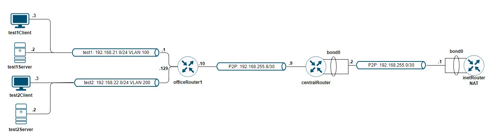

# LAB-19
## Vagrant-стенд c VLAN и LACP
### Цели
- Научиться настраивать VLAN и LACP.

## Описание домашнего задания
1. В Office1 в тестовой подсети появляется сервера с доп интерфейсами и адресами

2. В internal сети testLAN: 
- testClient1 - 10.10.10.254
- testClient2 - 10.10.10.254
- testServer1- 10.10.10.1 
- testServer2- 10.10.10.1

3. Равести вланами:
testClient1 <-> testServer1
testClient2 <-> testServer2

4. Между centralRouter и inetRouter "пробросить" 2 линка (общая inernal сеть) и объединить их в бонд, проверить работу c отключением интерфейсов

5. Схема стенда:

## Комментарии
1. С помощью Vagrant и Ansible разварачиваются и настраиваются семь ВМ
2. В процессе запуска на целевых ВМ выполняется проверка настроек VLAN/LAG интерфейсов 